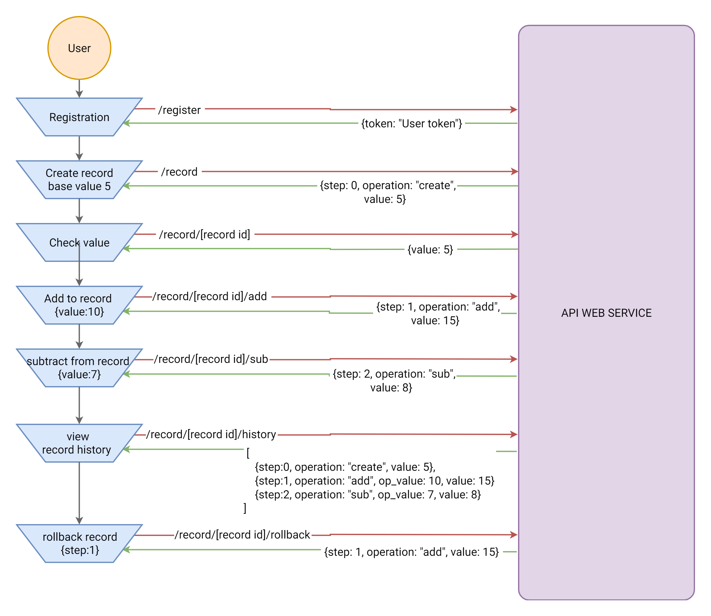

# Task 2 - Math Records web service

Create RESTFUL API (web service), that allows the user to create, maintain, and manipulate mathematical records.

## Requirements

- Account registration.
- Each account must have an access token.
- Token must comply with the 'authorization: token xxxx' header.
- Create a record.
- Delete record.
- View current value.
- View history for each record.
- View records list.
- Freeze/unfreeze record.
- Total operations count.
- Fork record.
- Check fork status with a reference to the original record.
- Execute mathematical operations `ADD`, `SUB`, `DIV`, `MULTI` on a specific record.
- Restore and rollback any point in the record history.
- Limit 5 records per account.
- Each record should have a unique unguessable ID.
- ALL responses should have the right corresponding HTTP status codes.
- ALL endpoints should follow the RESTful conventions.
- Must write a clear project `readme.md` document, with all endpoint, methods, params, auth info, and getting started example.

## Example workflow

## References

- RESTful tutorial - https://www.restapitutorial.com
- HTTP status codes - https://httpstatuses.com

Clients

- Postman - https://www.getpostman.com
- Insomnia - https://insomnia.rest

## Time

**Duration**: 10 days

**From**: 04-07-2018

**To**: 14-07-2018
